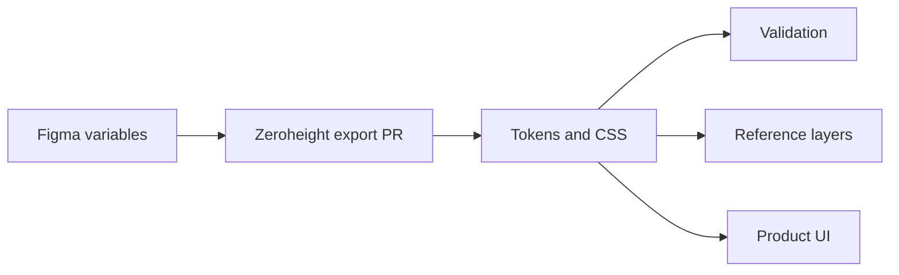

# Paryatech Design System

Source of truth for ParyatechOS visual decisions, tokens, and reusable UI patterns. It connects Figma variables exported by Zeroheight with product code and gives designers, developers, and AI agents the same constraints.

## Start here

- AI agents: read [`SKILL.md`](SKILL.md), [`product.md`](product.md), and [`design.md`](design.md).
- Designers: read [`docs/design-direction.md`](docs/design-direction.md) and the relevant foundation/component guidance.
- Developers: read [`docs/architecture/token-architecture.md`](docs/architecture/token-architecture.md) and consume mode-specific files in `CSS/` or `Tokens/`.

## Repository map

```text
CSS/             Zeroheight CSS exports; do not hand-edit
Tokens/          Zeroheight DTCG JSON exports; do not hand-edit
tokens/          Generated agent-friendly reference layers
docs/            Architecture, foundations, and component guidance
scripts/         Token extraction and validation
SKILL.md         Operational AI instructions
product.md       Product intent and workflows
design.md        Design direction and anti-patterns
```

## Token flow



## Update workflow

1. Change variables in the approved Figma library.
2. Let Zeroheight open/update its export pull request.
3. Run `node scripts/build-token-reference.mjs`.
4. Run `node scripts/validate-design-system.mjs`.
5. Review semantic intent, mode coverage, alias integrity, and visual regressions.

Current modes cover Light/Dark and Compact/Standard/Wide desktop, plus compact-light contextual exports. Generated files are not hand-edited. Reuse an existing semantic token and documented pattern first; add one only for a repeated unmet product need and document it in the same PR.
